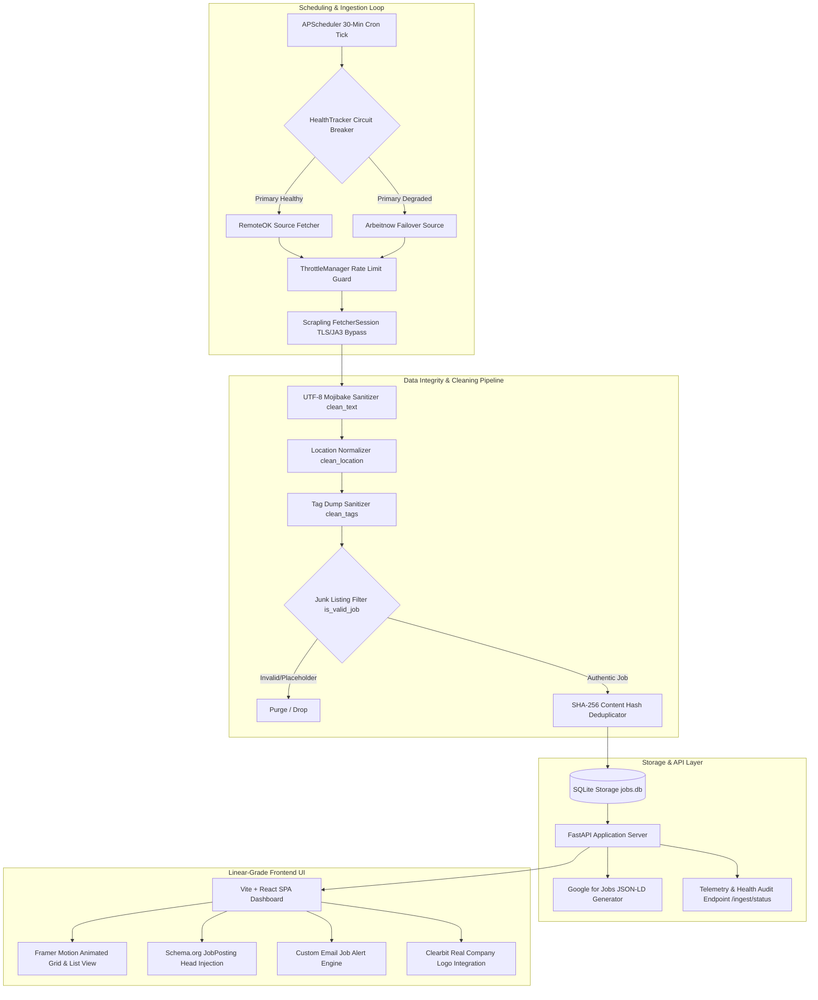

# Job Scraper — Resilient Ingestion Engine & Remote Opportunities Radar

> **Acdyon Technologies Engineering Challenge — Part 1 (Data Ingestion & Scraper Track)**  
> A resilient, anti-fingerprint job-listing ingestion engine that harvests remote postings from public APIs on a 30-minute schedule, sanitizes UTF-8 encoding glitches, filters junk listings, survives source outages with automated circuit breakers, and serves opportunities over a high-performance FastAPI backend and Linear/Vercel-grade Framer Motion React UI.

---

## 🏗️ System Architecture & Data Flow



---

## 🌟 Key Architecture Capabilities

### 1. 🛡️ Data Integrity & Content Sanitization Pipeline (`app/ingestion/cleaner.py`)
- **UTF-8 Mojibake Repair**: Fixes encoding corruption (e.g. `Jaboatão` $\rightarrow$ `Jaboatão`, `Ribeirão Preto` $\rightarrow$ `Ribeirão Preto`) caused by Latin-1 / UTF-8 misdecoding.
- **Junk & Placeholder Filtering**: Rejects spam and placeholder titles (`"Title TBD"`, `"404"`, `"Test Job"`, `"Looking for Job"`, `"Current Openings"`, `"All Other Future Considerations"`, `"Express Your Interest"`).
- **Tag Dump Sanitization**: Strips copy-pasted generic tag lists ($>10$ tags) down to max 6 title-relevant tags.
- **Location Normalization**: Removes trailing commas and broken template formatting (e.g. `"Toronto,"` $\rightarrow$ `"Toronto"`).

### 2. 🚀 Google for Jobs SEO Flywheel (`JobPosting` Schema.org JSON-LD)
- Direct API generation (`generate_job_posting_jsonld`) and client-side modal head injection of valid `schema.org/JobPosting` JSON-LD metadata for search engine indexing.

### 3. ⚡ Resilient Scraping Engine & Circuit Breaker (`app/ingestion/health.py`)
- **Circuit Breaker Router**: Automatically routes traffic away from failing endpoints after 3 consecutive errors.
- **Scrapling Session**: Bypasses TLS/JA3 fingerprinting using randomized browser profiles.
- **Content-Hash Deduplication**: SHA-256 checksum prevention of duplicate database entries.

---

## 🚀 Render Deployment (Step-by-Step)

### Render Free Tier Deployment (Recommended)

1. **Push to GitHub**:
   Ensure your repository is pushed to GitHub:
   ```bash
   git push origin main
   ```

2. **Deploy on Render**:
   - Go to [Render Dashboard](https://dashboard.render.com).
   - Click **New +** $\rightarrow$ **Web Service**.
   - Connect your GitHub repo (`acdyon-job--scraper`).
   - Render automatically picks up `render.yaml` Blueprint or manual settings:
     - **Runtime**: `Python`
     - **Build Command**: `pip install -r requirements.txt`
     - **Start Command**: `uvicorn app.main:app --host 0.0.0.0 --port $PORT`
   - Render will build Python dependencies and immediately serve the pre-compiled production React application from `frontend/dist`.

> **Note**: `frontend/dist` is tracked in the repository to ensure zero Node.js build overhead on Render's Python free tier.

---

## 🐳 Docker Compose Deployment (Local or VPS)

Run the full stack (React Frontend + FastAPI Backend + Ingestion Loop) inside Docker:

```bash
docker compose up --build -d
```

Navigate to **`http://localhost:8005`** to access the dashboard.

---

## 💻 Local Development Setup (Without Docker)

### 1. Environment Setup
```powershell
# Create & activate Python virtual environment
python -m venv venv
.\venv\Scripts\activate

# Install backend requirements
pip install -r requirements.txt

# Create environment file
cp .env.example .env
```

### 2. Build React Frontend
```powershell
cd frontend
npm install
npm run build
cd ..
```

### 3. Run Backend Server
```powershell
.\venv\Scripts\python.exe -m uvicorn app.main:app --host 127.0.0.1 --port 8005
```

Open **`http://127.0.0.1:8005/`** in your browser.

---

## 🧪 Automated Test Suite

Run pytest to verify failover circuit breakers, rate limits, and Scrapling selector re-anchoring:

```powershell
$env:PYTHONPATH="."
.\venv\Scripts\python.exe -m pytest tests/
```

- `test_router_failover.py`: Validates failover to fallback source after 3 consecutive failures.
- `test_adaptive_reanchor.py`: Validates Scrapling element re-anchoring across markup shifts.
- `test_empty_response_guard.py`: Validates soft-fail handling on HTTP 200 OK empty payload responses.

---

## 📄 Engineering Design & Decisional Analysis

For detailed analysis of anti-bot detection surfaces, ingestion strategies, ethical boundaries, and responses to the three mandatory challenge questions, view **[DECISIONS.md](file:///d:/job-radar/scraper/DECISIONS.md)**.
