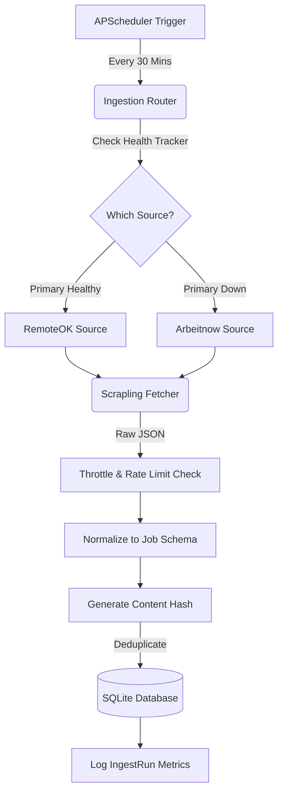

# Scrapling Job Radar - Workflow & Architecture

This document breaks down the internal workflow and technical architecture of the **Scrapling Job Radar** project. The project is designed as a highly resilient, fail-safe ingestion pipeline that pulls job listings on a schedule.

## 1. High-Level Architecture

The system consists of three main layers operating concurrently:

1. **The Scheduler Layer**: An `APScheduler` loop running in the background.
2. **The Ingestion Pipeline**: The core engine that handles routing, throttling, network fetches, data normalization, deduplication, and database insertion.
3. **The API & Frontend Layer**: A FastAPI web server that serves the stored jobs to a minimal vanilla JavaScript dashboard.

---

## 2. The Ingestion Workflow (Tick by Tick)

Every time the scheduler fires (or when the app starts), it triggers a single **"tick"** of the ingestion pipeline. Here is exactly what happens during that tick:

### Step 1: Health Check & Routing (`router.py`)
- The pipeline asks the `HealthTracker` for the status of the primary source (RemoteOK).
- If RemoteOK has failed 3 times consecutively, it is marked as `down`.
- The router then seamlessly falls over to the fallback source (Arbeitnow).

### Step 2: Rate Limiting & Throttling (`throttle.py`)
- Before sending the network request, the pipeline checks the `ThrottleManager`.
- If the previous request returned a `429 Too Many Requests`, the throttle dynamically waits according to the `Retry-After` headers or applies an exponential backoff to ensure we don't get banned.

### Step 3: Fetching (`sources/`)
- A robust HTTP request is fired via **Scrapling's** `FetcherSession` using stealth headers.
- If the endpoint returns an empty list, the pipeline activates the **Empty-Response Guard**—it treats it as a network hiccup, retries once immediately, and if still empty, registers a soft failure.

### Step 4: Normalization (`models/job.py`)
- The raw JSON response is parsed into a unified `RawJob` schema. 
- This means whether the job came from RemoteOK or Arbeitnow, it looks exactly the same to our database.

### Step 5: Deduplication & Storage (`storage/repository.py`)
- The pipeline generates a SHA-256 `content_hash` for every job based on its Title, Company, and URL.
- It attempts to insert the jobs into the SQLite database (`jobs.db`). If a job with the same hash already exists, it is ignored (preventing duplicates).

### Step 6: Telemetry Logging
- The pipeline writes an `IngestRun` record to the database logging the duration, items inserted, and any errors encountered. This telemetry powers the `/ingest/status` API.

---

## 3. The API Layer (`api/routes.py`)

The FastAPI application provides three critical endpoints:

- `GET /jobs`: Retrieves the latest jobs from the database. It also checks the `IngestRun` logs—if no successful ingest has occurred within the last 120 minutes, it flags the `stale: true` warning so the frontend can alert the user.
- `GET /ingest/status`: Provides real-time visibility into the health states of the sources and the logs of the last 10 ingestion runs.
- `GET /`: Serves the `index.html` file, running our dynamic vanilla JavaScript UI.

## 4. Resilience Testing (`tests/`)

The pipeline's resilience is mathematically proven using a sandboxed mock server:
- **`test_router_failover.py`**: Verifies that 3 failures force the fallback source to activate.
- **`test_adaptive_reanchor.py`**: Verifies that Scrapling's adaptive element fingerprinting can survive overnight HTML markup redesigns. 
- **`test_empty_response_guard.py`**: Ensures empty 200 OK responses don't accidentally wipe out cache or assume jobs are gone.
